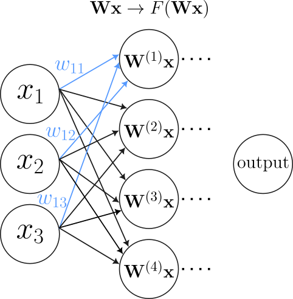
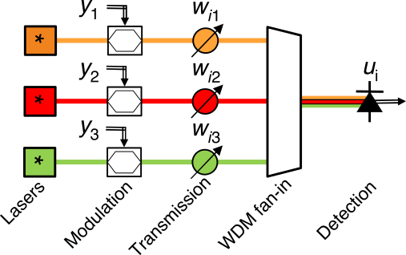
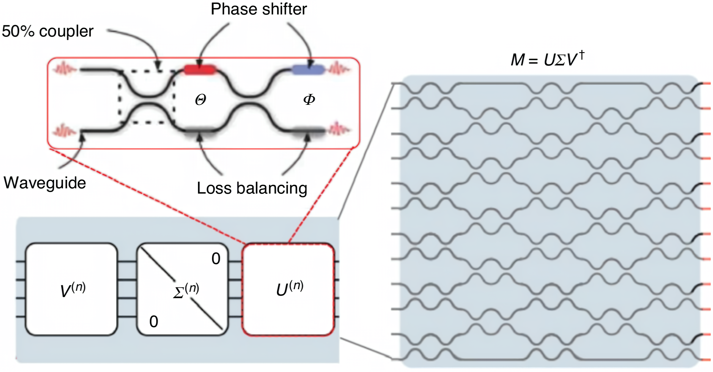
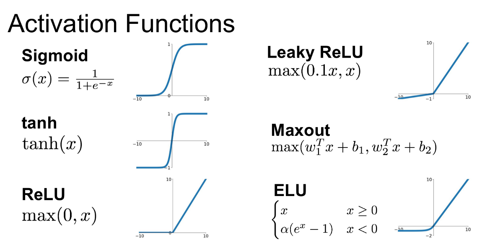
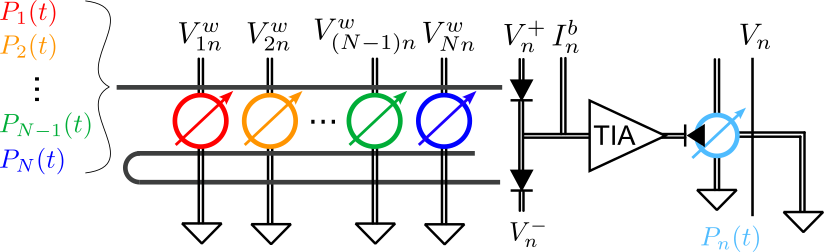
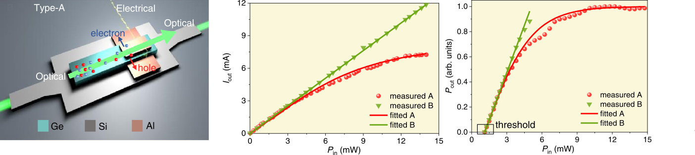

## Brief introduction to neural networks
Neuromorphic computing is a paradigm based on ANNs, which process information in a distributed manner. This is a benefit for certain tasks—usually ones unsuited for regular computing.

:::: {.columns}

::: {.column width="55%"}
- Neural networks: Neurons and weights:
$$
\small
\mathbf{W}^{(1)}\mathbf{x}=w_{11}x_1+w_{12}x_2+w_{13}x_3
$$
- From linear regression to something useful.
- Non-linear activation function&rarr;UAT.
- So, neural networks are "just" glorified curve-fitting (many-dimensional, $\sim10^9$ parameters).
:::

::: {.column width="45%"}
{.absolute bottom=0 right=0}
:::

::::

## Why photonics?
- "Massively distributed hardware relies heavily [...] on massively parallel interconnections between lumped elements."
- Efficient linear operations, less heat, less long-range frequency-dependent signal distortion.
- Time-division multiplexing trades bandwidth for interconnectivity.

Thus, the applications that benefit from neuromorphic photonics are ones that require *low latency*, *high bandwidth* and *low energies* [@Shastri2020PhotonicsFA]:

- Qubit readout classification.
- Particle classification in high-energy physics.
- Non-linear optimization problems.

## Components of a photonic neural network
- Need to receive/distribute multiple inputs/outputs (fan-in/out). Often done with wavelength multiplexing.
- Implementation of reconfigurable weights and weighted sum (matmul).
- Non-linear activation function.
- Get result at the end (typically detection).

:::: {.columns}

::: {.column width="45%"}
Figure courtesy of [@Shastri2020PhotonicsFA]
:::

::: {.column width="55%"}
{width=100% fig-align="right"}
:::
::::

## Physical implementation of neural network weights
- As mentioned, we need weighted interconnections that can be combined with weighted sums (matrix-vector multiplication).
- Typically implemented with either a wavelength-based approach or a mode-based approach (see next slides).
- Neural network weights have no restrictions on their values. It is not enough to implement unitary transformations; we need arbitrary transformations.
- Training is done by tuning the weights. Thus, the weight implementation *must* be reconfigurable.

## Wavelength-based weight implementation
The wavelength-based approach is typically implemented using micro ring resonators (MRRs), in the "broadcast-and-weight" architecture introduced by [@7479545]. The MRRs act as attenuators, "weighting" the signals.

{}

## Mode-based weight implementation
As we know, MZIs can be used to implement any unitary transformation, which is not sufficient for all possible weight matrices. However, it turns out that *any* transformation can be implemented as the product of a diagonal matrix and two unitary matrices. Figure courtesy of [@Shen_2017].

{fig-align="center"}

## Implementation of non-linear activation functions
:::: {.columns}

::: {.column width="50%"}
**O/E/O activation functions**

- Typical implementation: Detector for O/E conversion, then some electronics for nonlinearity and E/O conversion.
- Ease of implementation.
- Possibility of amplified output signal.
- Bandwidth limitations.
- High energy consumption.
:::

::: {.column width="50%"}
**All-optical activation functions**

- Typical implementation: Some process in the optical domain where transmission is nonlinear. Examples include PCMs, FCA, saturable absorption.
- Harder to implement, optical nonlinearity is often weak.
- Lower energy consumption.
- Integration and scalability.
:::

::::

. . .

{.absolute top=100 left=100}

## Optoelectronic nonlinearity implementation
The implementation from [@9864251] uses a balanced photodetector, followed by a transimpedance amplifier to convert the photocurrent to a voltage signal. This is used to control a ring modulator, which is used to perform the E/O conversion, resulting in non-linear transmission.

{.nostretch fig-align="center"}

## All-optical nonlinearity implementation
Implementation from [@Shi_2022] is based on a Ge-Si waveguide-integrated photodetector with a shortened electrode. FCA occurs in the electrodeless region, providing the nonlinearity (no FCA in the electrode region, where carriers are absorbed instantly). FCA is intraband (i.e. generates no photocurrent), but some photocurrent is generated due to intrinsic absorption. This can be used for monitoring the power in the NN.

{fig-align="center"}

## Bibliography
