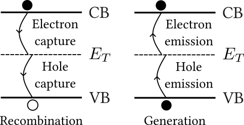

```{python}
from pymatreader import read_mat
import pickle
import plotly.graph_objects as go

def load_object(filename):
    with open(filename, 'rb') as inp:  # Overwrites any existing file.
        obj = pickle.load(inp)
    return obj

data = read_mat(r"C:\Users\qp\Desktop\ali\Lumerical Simulations\fk_device\dark_current_demonstration.mat")
voltages = data["voltages"]
I_bbt = data["I_bbt"]*1e6
I_srh = data["I_srh"]*1e6
I_au = data["I_au"]*1e6
I_ii = data["I_ii"]*1e6
I_uncorrected = data["I_uncorrected"]*1e6
I_uncorrected_calculated = data["I_uncorrected_calculated"]*1e6
I_corrected = data["I_corrected"]*1e6
I_corrected_okuto = data["I_corrected_okuto"]*1e6
V_measured = data["V_measured"]
I_measured = data["I_measured"]
I_corrected_v2 = data["I_corrected_v2"]*1e6
```

## Recap from last time
- Simulation workflow: Electrical, optical, electrical.
- Main result of simulation: The device works almost perfectly as an APD with virtually no dark current.
- So how can we make it realistic...

## Understanding the leakage current 
As we know, a p-i-n junction has a depletion region with a potential barrier for carriers, which increases with increasing reverse bias. So, how come we see current at reverse bias in the lab?

. . .

Answer: Generation/recombination processes! Carriers are generated in the depletion region and swept away by the strong field. The most important of these are:

- Schockley-Read-Hall recombination.
- Band-to-band tunneling.
- Impact ionization.

## Shockley-Read-Hall recombination 
In practice, any real semiconductor has impurities. This has the following implications:

- Breaking of the crystal's periodicity &rarr; states inside gap.
- Doping vs impurities? Hydrogenic states vs *deep defects*.
- SRH states can capture/emit electron/holes.
- Total SRH rate depends on $E_{T}$.
$$
\begin{aligned}
&\hspace{-9em}R_{srh} = \frac{np-n_i^2}{\tau_p(n+n_1)+\tau_n(p+p_1)}
\end{aligned}
$$

- Doping & field corrections.
- Limitation: Only a single impurity level.

{.absolute bottom="80" right="25"}

## Band-to-band tunneling
::: {layout-ncol=2}
- How can we go from VB&rarr;CB? How does this generate current?
- Remember from QM that tunneling probability has proportionality
$$
T \propto e^{-2\kappa W}
$$
- Tunneling distance as a function of reverse bias.
- Dominates at high field strengths.
- BBT recombination rate (Kane, 1961)
$$R_{BBT}=A_{BBT}\left(\frac{F}{1 \text{ V/cm}}\right)^\sigma e^{-\frac{B_{BBT}}{F}}$$

```{python}
fig = load_object(r"pickle_figs\bands_td.pkl")
fig.update_xaxes(showline=True, linewidth=1.4, linecolor='black', ticks="outside", mirror="allticks", tickwidth=1.4, tickcolor="black", title=r"z (nm)")
fig.update_yaxes(showline=True, linewidth=1.4, linecolor='black', ticks="outside", mirror="allticks", tickwidth=1.4, tickcolor="black", title=r"E (eV)")
fig.update_layout( 
    height=550,
    font=dict(
        family="Computer Modern",
        size=20,
    ),
)
fig.data[40]["visible"] = "legendonly"
fig.show()
```
:::

## Impact ionization
When subject to a strong field, carriers possess enough energy to excite other carriers across the bandgap, creating EH-pairs that can participate in further impact ionization events, leading to carrier multiplication.

Impact ionization is a pure generation process, with a rate
$$
R_{II} = -\alpha_n \frac{\left|\mathbf{J_n}\right|}{q} -\alpha_p \frac{\left|\mathbf{J_p}\right|}{q},
$$
where the impact ionization coefficients are given by Selberherr's model
$$
\alpha_{n,p} = \alpha^{\infty}_{n,p} \times \exp{\left[-\left(\frac{F^{crit}_{n,p}}{F}\right)^{\beta_{n,p}}\right]}
$$
in units of inverse distance.

## So, what was the issue?
- All models responsible for dark current were already turned on.
- However: All parameters in BBT model were set to 0 by default.

**Lesson:** Remember to actually check all the parameters for all the physical models! Don't assume that there are sensible defaults for everything.

Initial estimates for the BBT parameters can be generated using the theory from (Keldysh & Kane, 1961)
$$
\begin{aligned}
A_{BBT}&=\frac{g\pi\sqrt{m_r}(qE_0)^2}{9h^2\sqrt{E_g}}\\
B_{BBT}&=\frac{\pi^2\sqrt{m_r}E_g^{3/2}}{qh}\\
\end{aligned}
$$

## Getting stuck and asking for help
With all the physical models set up correctly, it was time for an extended stay in convergence hell, which went like this

::: {.incremental}
- Tweak material/model/convergence parameter.
- Run the simulation, wait half an hour for it to crash.
- Repeat 7 billion times.
- Give up, contact EDR&Medeso at [ansys@edrmedeso.com](mailto:ansys@edrmedeso.com).
:::
. . .

How the support request went

- Support person also got stuck in convergence hell for a week and had to contact ANSYS (very fair).
- I came up with an alternative solution to the problem in the meantime.
- Overall: Quite pleasant—and you'll likely have a smoother experience!

## The escape strategy
The convergence issues result mainly from the impact ionization model. If we switch it off, we can easily converge even beyond breakdown. Naturally, the high-field reverse bias IV-curve depends strongly on this model. So how can we get a correct current with the model turned off?
 
. . .

- Main thing to remember: Field distribution, recombination rates & current for the other recombination processes are all still correct.
- Calculate total current with joint simulation and analytical approach
$$\small I_{total} = qL_x \int_{-L_z/2}^{L_z/2} \int_{-L_y/2}^{L_y/2} (R_{net,sim}+R_{II,calc})dy dz,$$
using the equations shown earlier & plugging in simulated quantities
$R_{II,calc} = -\alpha_{n,calc} \frac{\left|\mathbf{J}_{n,sim}\right|}{q} -\alpha_{p,calc} \frac{\left|\mathbf{J}_{p,sim}\right|}{q}, \ \alpha_{n,p,calc} = \alpha^{\infty}_{n,p} e^{-\left(\frac{F^{crit}_{n,p}}{F_{sim}}\right)^{\beta_{n,p}}}$

## First results from joint simulation-analytical approach
- Perform sanity check. Can we reproduce the simulated current?
- Compare current with and without impact ionization.

```{python}
#| layout-ncol: 2
fig = go.Figure()

fig.add_trace(
    go.Scatter(
        x=voltages,
        y=I_uncorrected,
        mode="markers",
        name="Simulated",
    )
)

fig.add_trace(
    go.Scatter(
        x=voltages,
        y=I_uncorrected_calculated,
        mode="lines",
        name=r'Calculated',
    )
)

fig.update_layout(
    width=500,
    paper_bgcolor='rgba(255,255,255,1)',
    plot_bgcolor='rgba(255,255,255,1)',
    height=450,
    margin=dict(l=10,r=10,t=10,b=10),
    legend=dict(
        yanchor="bottom",
        y=0,
        xanchor="right",
        x=0.99,
    ),
    xaxis=dict(
        title=dict(
            text="Voltage (V)",
        )
    ),
    yaxis=dict(
        title=dict(
            text=r"Current (µA)",
        )
    ),
    font=dict(
        family="Computer Modern",
        size=20,
    )
)

fig.update_xaxes(showline=True, linewidth=1.4, linecolor='black', ticks="outside", mirror="allticks", tickwidth=1.4, tickcolor="black")
fig.update_yaxes(showline=True, linewidth=1.4, linecolor='black', ticks="outside", mirror="allticks", tickwidth=1.4, tickcolor="black")

fig.show()
fig = go.Figure()

fig.add_trace(
    go.Scatter(
        x=voltages,
        y=I_uncorrected,
        mode="lines",
        name="Without impact ionization",
    )
)

fig.add_trace(
    go.Scatter(
        x=voltages,
        y=I_corrected,
        mode="lines",
        name=r"With impact ionization",
    )
)

fig.update_layout(
    width=500,
    paper_bgcolor='rgba(255,255,255,1)',
    plot_bgcolor='rgba(255,255,255,1)',
    height=450,
    margin=dict(l=10,r=10,t=10,b=10),
    legend=dict(
        yanchor="bottom",
        y=0,
        xanchor="right",
        x=0.99,
    ),
    xaxis=dict(
        title=dict(
            text="Voltage (V)",
        )
    ),
    yaxis=dict(
        title=dict(
            text=r"Current (µA)",
        )
    ),
    font=dict(
        family="Computer Modern",
        size=20,
    ),
)

fig.update_xaxes(showline=True, linewidth=1.4, linecolor='black', ticks="outside", mirror="allticks", tickwidth=1.4, tickcolor="black")
fig.update_yaxes(showline=True, linewidth=1.4, linecolor='black', ticks="outside", mirror="allticks", tickwidth=1.4, tickcolor="black")

fig.show()
```

## Breaking the results down further
:::: {.columns}
::: {.column width="55%"}
- Joint analytical-simulation approach allows us to calculate individual current contributions easily.
```{python}
fig = go.Figure()

fig.add_trace(
    go.Scatter(
        x=voltages,
        y=I_srh,
        mode="lines",
        name="Shockley-Read-Hall",
    )
)

fig.add_trace(
    go.Scatter(
        x=voltages,
        y=I_bbt,
        mode="lines",
        name=r"Band-to-band tunneling",
    )
)

fig.add_trace(
    go.Scatter(
        x=voltages,
        y=I_ii,
        mode="lines",
        name=r"Impact ionization",
    )
)

fig.update_layout(
    width=500,
    paper_bgcolor='rgba(255,255,255,1)',
    plot_bgcolor='rgba(255,255,255,1)',
    height=450,
    margin=dict(l=10,r=10,t=10,b=10),
    legend=dict(
        title="Contribution to current",
        yanchor="bottom",
        y=0,
        xanchor="right",
        x=0.99,
    ),
    xaxis=dict(
        title=dict(
            text="Voltage (V)",
        )
    ),
    yaxis=dict(
        title=dict(
            text=r"Current (µA)",
        )
    ),
    font=dict(
        family="Computer Modern",
        size=20,
    ),
)


fig.update_xaxes(showline=True, linewidth=1.4, linecolor='black', ticks="outside", mirror="allticks", tickwidth=1.4, tickcolor="black")
fig.update_yaxes(showline=True, linewidth=1.4, linecolor='black', ticks="outside", mirror="allticks", tickwidth=1.4, tickcolor="black")

fig.show()
```

:::
::: {.column width="5%"}
:::
::: {.column width="40%"}
| Parameter             | Value                                          |
|-----------------------|:-----------------------------------------------|
| $\alpha_n^{(\infty)}$ | $2.99\times10^5\text{ 1/cm}$                   |
| $\alpha_p^{(\infty)}$ | $2.22\times10^5\text{ 1/cm}$                   |
| $\beta_n$             | $1.6$                                          |
| $\beta_p$             | $1.75$                                         |
| $F_{crit, n}$         | $6.85\times10^5\text{ V/cm}$                   |
| $F_{crit, p}$         | $6.57\times10^5\text{ V/cm}$                   |
| $A_{BBT}$             | $1.782\times10^7\text{ V/cm}$                  |
| $B_{BBT}$             | $1.541\times10^{20} \mathrm{ 1/cm^3 s}$        |
| $E_{offset}$          | $0.3\text{ eV}$                                |
: Main simulation parameters 

:::

::::

## Final results
### Checking impact ionization model and fitting dark IV-curve
```{python}
#| layout-ncol: 2
fig = go.Figure()

fig.add_trace(
    go.Scatter(
        x=voltages,
        y=I_corrected,
        mode="markers",
        name="Selberherr",
    )
)

fig.add_trace(
    go.Scatter(
        x=voltages,
        y=I_corrected_okuto,
        mode="lines",
        name=r"Okuto-Crowell",
    )
)

fig.update_layout(
    width=500,
    paper_bgcolor='rgba(255,255,255,1)',
    plot_bgcolor='rgba(255,255,255,1)',
    height=450,
    margin=dict(l=10,r=10,t=10,b=10),
    legend=dict(
        title="Impact ionization model",
        yanchor="bottom",
        y=0,
        xanchor="right",
        x=0.99,
    ),
    xaxis=dict(
        title=dict(
            text="Voltage (V)",
        )
    ),
    yaxis=dict(
        title=dict(
            text=r"Current (µA)",
        )
    ),
    font=dict(
        family="Computer Modern",
        size=20,
    ),
)

fig.update_xaxes(showline=True, linewidth=1.4, linecolor='black', ticks="outside", mirror="allticks", tickwidth=1.4, tickcolor="black")
fig.update_yaxes(showline=True, linewidth=1.4, linecolor='black', ticks="outside", mirror="allticks", tickwidth=1.4, tickcolor="black")

fig.show()

fig = go.Figure()

fig.add_trace(
    go.Scatter(
        x=V_measured,
        y=I_measured,
        mode="lines",
        name="Measured",
    )
)

fig.add_trace(
    go.Scatter(
        x=voltages,
        y=I_corrected_v2,
        mode="lines",
        name=r"Simulated",
    )
)

fig.update_layout(
    width=500,
    paper_bgcolor='rgba(255,255,255,1)',
    plot_bgcolor='rgba(255,255,255,1)',
    height=450,
    margin=dict(l=10,r=10,t=10,b=10),
    legend=dict(
        yanchor="bottom",
        y=0,
        xanchor="right",
        x=0.99,
    ),
    xaxis=dict(
        title=dict(
            text="Voltage (V)",
        )
    ),
    yaxis=dict(
        title=dict(
            text=r"Current (µA)",
        )
    ),
    font=dict(
        family="Computer Modern",
        size=20,
    ),
)

fig.update_xaxes(showline=True, linewidth=1.4, linecolor='black', ticks="outside", mirror="allticks", tickwidth=1.4, tickcolor="black")
fig.update_yaxes(showline=True, linewidth=1.4, linecolor='black', ticks="outside", mirror="allticks", tickwidth=1.4, tickcolor="black")

fig.show()
```